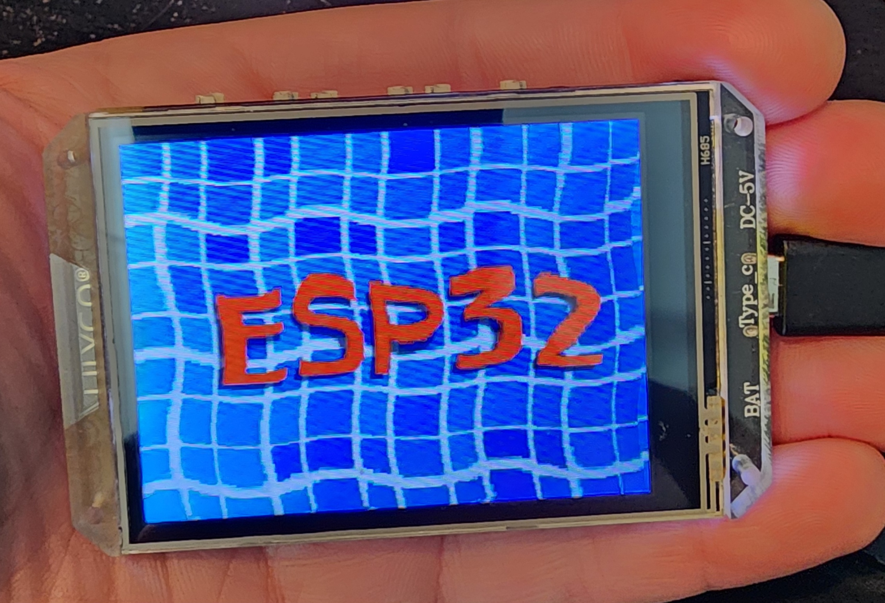
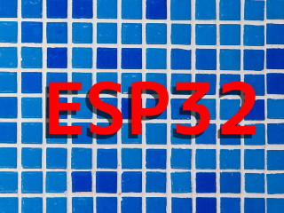
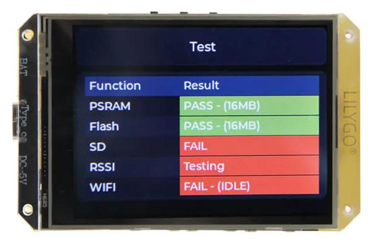

# JPG Decode Example ESP-IDF

## Configured to Use LilyGO T-HMI

There were a few tweaks that were needed but this is a working example, using the pretty_effect. Hint: it's wavy.

I added a power on function, the setup routines that came with the example did not provide this necessary step. Very simply we just set the PWR_EN and PWR_ON pins as outputs and drive them high.

I had to also swap the y axes.

Here is an image of the working demo:

## LCD Example

As of this latest commit on 22 May 2023, the ESP demo is running but I have not integrated the XPT2046 touch features yet. First I plan to output raw -> screen_coords to the terminal via log calls.

The example will load the ESP image shown below and make it wavy. The framerate can be altered by changing the pixel clock frequency: `EXAMPLE_LCD_PIXEL_CLOCK_HZ`, currently set at 10 MHz.

## Overview

This example shows how to decode a jpeg image and display it on an SPI-interfaced LCD, and rotates the image periodically. (I actually just kept it from rotating)

If you want to adapt this example to another type of display or pinout, check [lcd_tjpgd_example_main.c](main/lcd_tjpgd_example_main.c) for comments with some implementation details.

## How to Use Example

### Hardware Required

* LilyGO T-HMI Board
* An USB-C cable for power supply and programming

### Hardware Connection

#### Extra connections for 8-line LCD (Octal SPI)

Firstly, please run `idf.py menuconfig` and set the `Drive a LCD with 8 data lines` option at `Example Configuration`.

| GPIO number   | LCD pin |
| ------------- | ------- |
| PIN_NUM_DATA1 | 47      |
| PIN_NUM_DATA2 | 39      |
| PIN_NUM_DATA3 | 40      |
| PIN_NUM_DATA4 | 41      |
| PIN_NUM_DATA5 | 42      |
| PIN_NUM_DATA6 | 45      |
| PIN_NUM_DATA7 | 46      |

### Build and Flash

Run `idf.py -p PORT flash monitor` to build, flash and monitor the project. A flowing picture will be shown on the LCD screen.

(To exit the serial monitor, type ``Ctrl-]``.)

See the [Getting Started Guide](https://docs.espressif.com/projects/esp-idf/en/latest/get-started/index.html) for full steps to configure and use ESP-IDF to build projects.

## Troubleshooting

For any technical queries, please open an [issue] (https://github.com/espressif/esp-idf/issues) on GitHub. We will get back to you soon.

## Additional Information
[Espressif's Github](https://github.com/espressif)
[Code of Conduct](./CODE_OF_CONDUCGT.md)
[UNLINCENSE](./LICENSE)
